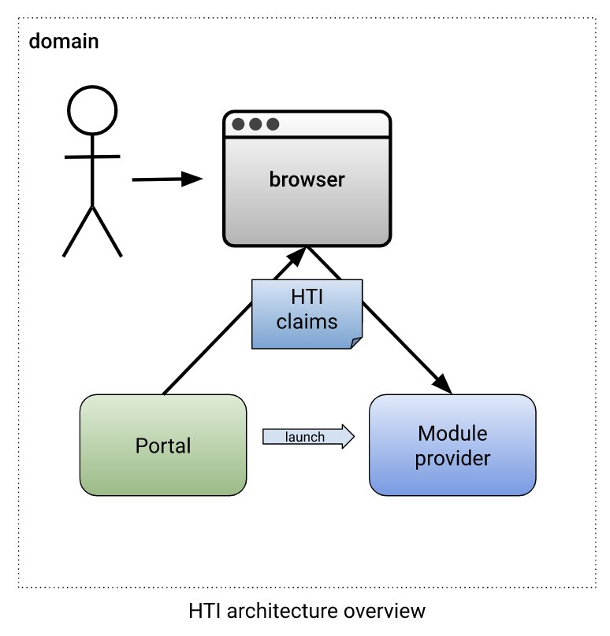
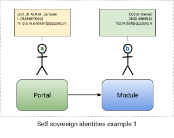
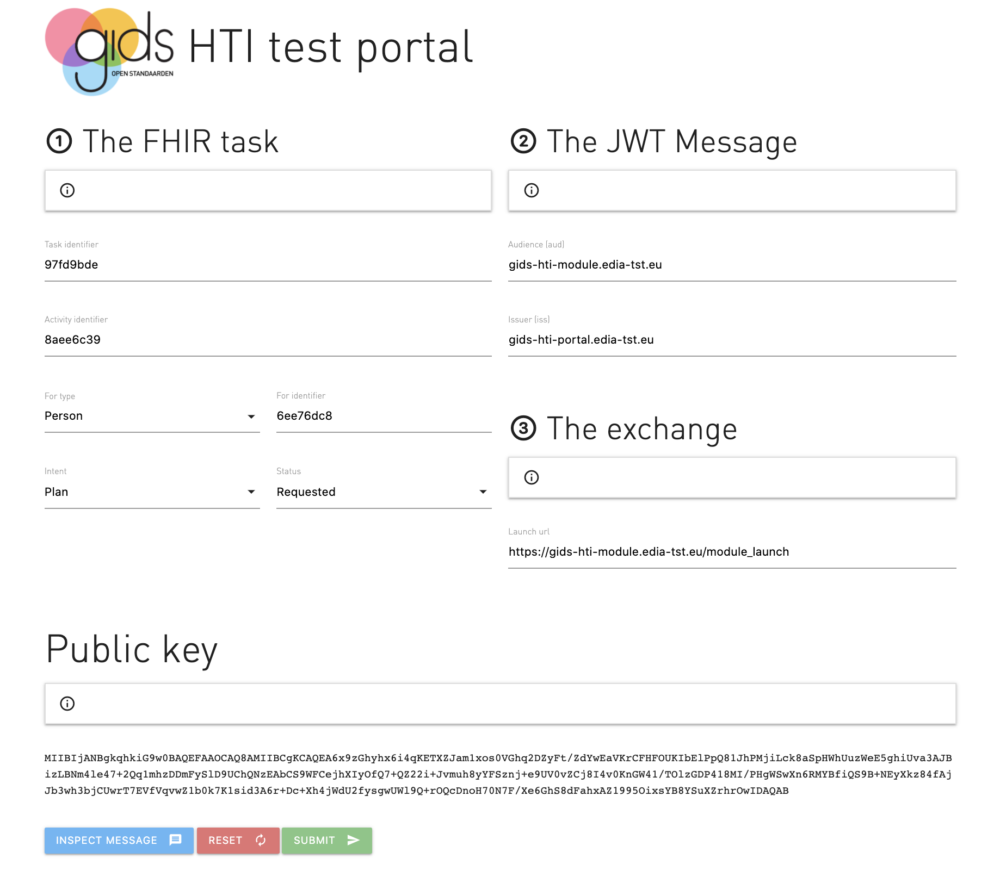

# GIDS Health Tools Interoperability
HTI:core version 2.0
Document version: 2.0.0
Date: 29-01-2023

- [GIDS Health Tools Interoperability](#gids-health-tools-interoperability)
  - [Goals and Rationale](#goals-and-rationale)
  - [About this document](#about-this-document)
  - [Architecture](#architecture)
    - [Concepts](#concepts)
    - [Domain model](#domain-model)
    - [Assumptions](#assumptions)
  - [Implementation guide](#implementation-guide)
    - [Semantic roles and responsibilities](#semantic-roles-and-responsibilities)
    - [① The HTI claims](#-the-hti-claims)
    - [② The message format](#-the-message-format)
    - [③ The message exchange](#-the-message-exchange)
    - [Putting it all together](#putting-it-all-together)
- [Profiles](#profiles)
  - [FHIR Store profile (HTI:smart_on_fhir)](#fhir-store-profile-htismart_on_fhir)
  - [JWE message encryption (HTI:jwe)](#jwe-message-encryption-htijwe)
    - [Restrictions](#restrictions)
    - [Layout of the message](#layout-of-the-message)
    - [Tip: JWT and JWE message detection](#tip-jwt-and-jwe-message-detection)
    - [Configuration and storage requirements](#configuration-and-storage-requirements)
- [Implementation checklist](#implementation-checklist)
  - [The portal application](#the-portal-application)
  - [The module application](#the-module-application)
  - [General requirements](#general-requirements)
- [Connection with the SNS Launch protocol](#connection-with-the-sns-launch-protocol)
- [HTI on Mobile](#hti-on-mobile)
- [Test tools and validators](#test-tools-and-validators)
  - [Introduction](#introduction)
  - [The module testsuite](#the-module-testsuite)

## Goals and Rationale
The GIDS Health Tool Interoperability protocol (HTI) is inspired by the IMS - Learning Tool Interoperability (LTI) which has had a tremendous proven impact on the relation between learner management systems and learning tool providers. The objectives of LTI are:
 1. To provide a mash-up style deployment model which is easy to configure by URL, key and secret.
 1. To define a protocol that allows for SSO which preserves the learning context and roles within that context.
 1. To make links to external applications portable by defining shared data elements.

LTI has simplified the integration of external tools into learner management systems, and a bright new landscape of tool providers has emerged. The key concepts the LTI being successful has been:
 1. The core the LTI standard is simple and clear.
 1. The LTI standard in its core form is easy to integrate because it makes use of existing technologies and standards.
 1. The core standard can be extended by profiles; within LTI there are profiles for reading roster information and writing results.


The HTI standard applies these concepts when it comes to defining a successful launch protocol. The key differences are:
 1. Use of JWT instead of OAuth 1.x. JWT is an IETF standard and is more advanced than OAuth 1.x.
 1. Aligned to the, in healthcare widely used, HL7 FHIR standard for references.
 1. The launch message contains no personal data.
 1. More restrictions on security, privacy and sharing data.


The HTI standard has the following goals.

#### Ease of software implementation.
The protocol should be easy to implement. This is done by making use of a simple core specification and allowing for more complexity and additional functionality in the form of profiles, and the use of existing standards.
#### Ease of use and configuration.
The protocol should be easy to configure from both the module and portals' side. In essence, an exchange of endpoint URL and public key pair should be sufficient.
#### Scalable, decentral, and point to point.
The architecture should not rely on external or central services and should be point-to-point in the sense that parties should be able to connect without relying on other parties and it should scale infinitely.
#### Secure
The protocol should mitigate against most common attacks by using proven technologies like JWT and JWE.
#### Privacy by Design
The protocol encourages user consent when exchanging personal information and is designed to minimize the exchange of personal information.
#### Align with existing standards
The standard makes use of existing technologies and standards, such as JWT, JWE and HL7 FHIR.


## About this document
This document makes use of the Requirement Levels as defined in [rfc2119](https://www.ietf.org/rfc/rfc2119.txt), commonly referred to as the MoSCoW method. A summary of the MoSCoW requirement can be found in the
section Implementation checklist. We have tried to make use of illustrations to visually enrich the concepts and relations between concepts of the standard. Examples are used whenever possible. Besides this document, a testsuite is made available, and reference implementations are published to github to help developers in their implementation journey.


## Architecture
The health tool interoperability standard (HTI) connects portals with modules like e-health treatments, (serious)games of any other type of functionality. This standard defines the concept of launch that entails both a transition from the portal to the module and a start of a new session on the module’s side. The HTI:core standard defines the communication protocol. the message format and the message exchange that is required to start a module from a portal in a domain.



### Concepts
* Portal, the service that links to the module, that is, an application like a tool, a game, or a treatment.
* Module provider, the service that delivers applications like tools, games, and/or treatments to the portal.
* Message, the package exchanged between portal and module that contains the relevant launch information.
* Domain, the scope of the data shared in the launch.

### Domain model
The launch message consists of a task object. The task object consists of the following fields:
* A reference to the user.
* A reference to the definition of the task.
Schematically, the relationship between the entities is displayed below:


### Assumptions
There are a number of assumptions on which the HTI:core standard is based. These assumptions are of relevance to the implementation of the standard as they function both as the starting point and as guidance to the (technical) decisions made in the realization of this standard.

#### Personal data
First and foremost, the message must not contain any personal information. The message does contain a reference to the user and the task at hand, but this reference must never be traceable to the real user. The user **MUST** be identified by a persistent pseudo identifier. The identifier **MUST** be unique in the domain. The portal **MUST** use a different identifiers for a user in each domain. The message **MUST NOT** contain any other identifier like a name, email account or social identification number. The persistent pseudo identifier **MUST** be randomly chosen and **MUST** contain enough entropy to block brute-force attacks.


#### Self-managed identities
As a consequence of the fact that no personal data may be exchanged by the launch, the module provider **MAY** query the user for information it needs. This data **MAY** be linked to the persistent pseudo identifier, so the user does not have to provide the same information again. This way the user controls what information it provides to the module provider on module launch.




#### Domains and scope of the persistent user identifier
The user identifier **MUST** be unique in each domain, and **MUST NOT** be shared between domains. If the relations between portal and module are between the same two legal entities **and** if there is a clear need to link the users identities between those relations **then** the portal **MAY** use one domain for multiple relations of the same user. **Otherwise** each relation **MUST** have each own domain.


#### User consent
The HTI:core specification specifically prohibits the exchange of personal data, however specific profiles that extend the HTI:core standard are allowed to exchange personal data. Thereby the HTI:core standard states that, If one of the systems in the domain transfers information from one system to another system in the domain, the user **MUST** provide consent. When asking consent, the user **MUST** be informed about all of the following:
* The source of the data.
* What data is shared.
* With whom it will be shared.
* For what period the data will be shared.
* For what purpose the data will be shared.

The user **MUST** be informed in a short and straightforward message, that **MUST** be in understandable language of maximum B1 level of the [CEFR framework](https://en.wikipedia.org/wiki/Common_European_Framework_of_Reference_for_Languages). Preferably the users’ primary language **SHOULD** be used.  It **MUST** be clear to the user what is asked and for what purpose.
Please note that the notion of a domain does not imply that consent can be shared between module providers and portals with domain level consent.

#### HTI profiles
The HTI:core standard defines the core part of the standard, consisting of the module launch. The HTI:core standard **MAY** be extended with profiles. These profiles **MAY** do the following:
 * ***Extend*** the specification by adding or modifying fields to the existing data model.
 * ***Replace*** specific parts of the standard, such as the way information is exchanged between systems.
 * ***Define*** additional functions, such as the exchange of information outside the scope of the launch.
A HTI profile **MUST** be documented properly and be the profile **MUST** clear about the relationship between HTI:core and the profile. The profile **MUST** identify themselves with a namespaced identifier, starting with “HTI:”, for example: HTI:smart_on_fhir. The HTI core standard is identified by HTI:core. It is encouraged to create profiles as specific as possible, and create multiple profiles if necessary.

#### To summarize:
* The launch message must not contain personal data.
* The module system may identify the user by its own means.
* All involved must have explicit users’ consent if personal data is disclosed to other parties.
* The standard may be extended with profiles, the core specification is defined as HTI:core.


 ## Implementation guide
The HTI:core standard defines the exchange of a message from the portal to the module. This exchange consists of the following parts:
 * ① The contents of the message: the **HTI claims**.
 * ② The serialization of the message into the **JWT message format**.
 * ③ The **exchange** of the message, how it is exchanged between the portal and the module.


### Semantic roles and responsibilities
As the HTI:core specification exists of three parts, these parts each have different roles and responsibilities. These are:
 * The ① HTI claims **MUST** only contain information about the functional task, the definition of the task, and the people involved.
 * The ② JWT message **MUST** only contain information about the sending system, the launching user, the recipient system and the message itself.
 * The ③ exchange of the message **MUST NOT** contain any information that falls in the categories defined by ① and ②. For example, it is not allowed to refer to a treatment by encoding one in the launch URL.
The diagram below summarizes these concepts.


### ① The HTI claims
The message consists of a set of HTI claims. Please note that the HTI version MUST be provided as the JWT claim `hti-version` to manage changes in the protocol between versions.

#### Identifiers and references
The HTI claims uses references from the FHIR standard. FHIR references have a type (resourceType) and identifier (id). A reference to an object consists of a combination of type and identifier. References to objects in the FHIR standard are notated as follows:
```
resourceType/id
```
In the diagram below, an example of such a reference:
```json
{
    "resource": "Task/a5e5844e"
}
```
The HTI:core standard defines that the reference format **MUST** align with the FHIR reference format when referencing claims that require the reference format.

#### Mapping of the HTI claims
The table below contains the required and suggested list of fields for the HTI claims, additional specification **MAY** be used in the HTI:core standard, however they **MUST NOT** contain personal information about the user. If you intend to use any additional fields, you **COULD** specify a HTI profile to do so.

| HTI claim | Type | Required | Value                                                                                                                                                                                                                                                                            |
|-----------|------|----------|----------------------------------------------------------------------------------------------------------------------------------------------------------------------------------------------------------------------------------------------------------------------------------|
| resource | string| yes | The identifier of the task to be executed by the person in the `sub` field.                                                                                                                                                                                                      |
| definition | url | no | A URL that references the definition of the task.                                                                                                                                                                                                                                |
| sub | reference | yes | This is a [person reference](#person-reference) to the patient, practitioner, or related person.                                                                                                                                                                                 |
| patient | reference | no | This is a [person reference](#person-reference) to the patient, only used when the 'sub' is not a patient                                                                                                                                                                        |
| intent | string| no | The intention of the launch, this field should be used to provide the intention of the launch such as the preparation, performance or review of the resource, is used, this field **MAY** be populated with a value from the [SMART on FHIR App Launch Intent](https://build.fhir.org/ig/HL7/smart-app-launch/scopes-and-launch-context.html#launch-intent). |
| hti-version | string | yes | The HTI version, needs to match the used HTI version. |

An example of the resulting HTI claims:

```json
{
    "resource": "Task/a5e582ac",
    "definition": "https://module.example.com/ActivityDefinition/a5e58200",
    "sub": "Practitioner/a5e58253",
    "patient" : "Patient/a5e582e",
    "intent": "plan",
    "hti-version": "2.0",
}
```

##### The task identifier (resource)
The `resource` is a reference to the instance of the task. In relation to the task definition, the task identifier changes when a user does the same task in a different context or for the second time. The task definition does not. The task id **MUST** be persistent over the timeframe the task instance is active. The task id is an identifier and not a reference.

##### The definition
The definition of the Task is described by the `definition` field. What a definition means, depends on the context. In the case of e-health, the definition could refer to an e-health treatment. For example, the "Fearfighter" module that offers help to people with phobia, anxiety disorder, or panic disorder. The definition **MUST** be a [canonical](http://hl7.org/fhir/R4/references.html#canonical) URL reference pointing to an `ActivityDefinition`. The following format is preferred:
```
https://<Domain>/ActivityDefinition/<Identifier>
```
The above format is [preferred](http://hl7.org/fhir/R4/activitydefinition-definitions.html#ActivityDefinition.url) over `urn:uuid:` and `urn:oid:` URIs.


##### Person reference
When referring to persons in the HTI claims, please keep in mind that a FHIR reference does allow personal details such as e-mail addresses and displayname as part of the FHIR standard. However, the HTI:core standard explicitly forbids the personal data to be exchanged by the launch. The user **MUST** be identified by a persistent pseudo identifier.
The `sub` field **SHOULD** always be a [person reference](#person-reference) to the user that should execute the task
The `sub` field is a reference that consists of both resource type and identifier. This implies that the format **MUST** be:
```
<ResourceType>/<Identifier>
```
The resource type **MUST** be a FHIR resource type, the FHIR task object does not limit the `for` field reference to a specific subset of FHIR resource types, so the resource type **MAY** be any of, and not limited to, the following types:
 * Patient
 * Practitioner
 * RelatedPerson
 * Person

In most cases, tasks will be assigned to a `Patient`. We advise to use the `Person` type if unsure about the resource type of the `sub` field.

The `patient` field **MAY** be used to denote the patient related to the HTI launch when the launch is executed by someone else than the patient (Practitioner or RelatedPerson). The same rules on format apply as for the `sub` field.

#### Configuration and storage requirements
The portal has the following storage and/or configuration requirements:
 * The `definition` of the HTI claims (s) of the module (s) need to be configured, having an agreed upon identifier, and optionally the name, image and description. To do so, the FHIR ActivityDefinition object **MAY** be used.
 * The `resource` of the HTI claims **MUST** represent a specific instance of an activity definition performed by a user and **MUST** be persistent over the timeframe the instance is active.
 * The user identifier (`sub` and `patient` field) **MUST** be both unique and persistent in each domain.

The module provider has the following storage and/or configuration requirements.
 * The activity definition should be agreed upon with the portal application.
 * Any additional information about the user attached to the persistent pseudo identifier, as the HTI claims that are exchanged at the launch is not to contain any personal data.

### ② The message format
The HTI claims **MUST** be exchanged as part of a JWT token. The HTI claims are mapped as Private Claim Names in the JWT token. The mapping of the JWT fields is as follows.

| Description | Field | Value |
| ------------- | ------------- | ------------- |
| Issuer | iss | This field **MUST** be a reference to the portal application that creates the JWT token. It **MAY** consist of an url or domain name of the portal application. The portal application and module provider **MUST** agree on the value of the iss field. The module provider **MUST** validate the message with the public key associated with the iss reference. The portal application **MAY** disseminate its public keys by the JKWS protocol, in that case the JWT token **MUST** contain a kid field in the JWT header. |
| Audience | aud | This field **MUST** be a reference to the module provider for which the JWT token is created for. The reference **MAY** consist of an url or domain name of the module provider. The portal application and module provider **MUST** agree on the value of the aud field. The module provider **MUST** validate the aud field to have the expected value. |
| Unique message id | jti | A unique identifier for this message. This value **MUST** be treated as a NONCE, a subsequent message with an identical jti **MUST** be rejected. The jti value must be a random or pseudo number, the jti **MUST** contain enough entropy to block brute-force attacks. |
| Issue time | iat | The timestamp of generating the JWT token, the value of this field **MUST** be validated by the module provider to not be in the future. |
| Expiration time | exp | The "exp" (expiration time) claim identifies the expiration time on or after which the JWT **MUST NOT** be accepted for processing. The value **MUST** be limited to 5 minutes. This value **MUST** be validated by the module provider, any value that exceeds the timeout **MUST** be rejected. |
| Subject | sub | This value **MUST** be a person reference to the user executing the launch. This way, applications can understand _who_ is launching the provided `Task`. For example, `Practitioner/82421`  |
| Resource | resource | The identifier of the task to be executed by the person in the `sub` field. |
| Definition | definition | A URL that references the definition of the task. |
| Patient | patient | Optional. This is a [person reference](#person-reference) to the patient, only used when the 'sub' is not a patient |
|Intent| intent | Optional. The intention of the launch, this field should be used to provide the intention of the launch such as the preparation, performance or review of the resource, is used, a value from the [FHIR value set RequestIntent](https://build.fhir.org/valueset-task-intent.html) |

The timestamps follows the ["UNIX time"](https://en.wikipedia.org/wiki/Unix_time) convention, being the number of seconds since the epoch.


#### Example message
The code fragment below shows the HTI claims as part of the JWT message payload.
```json
{
  "iat": 1585564845,
  "aud": "https://module.example.com",
  "iss": "https://portal.example.com",
  "exp": 1585565745,
  "jti": "679e1e4c-bcb9-4fcc-80c4-f36e7063545c"
  "sub" : "Practitioner/a5e58253",
  "resource" : "Task/11",
  "definition" : "https://module.example.com/ActivityDefinition/a5e58200",
  "patient" : "Patient/a5e582e",
  "intent": "plan"
}
```

#### Message layout
The JWT standard is documented at [jwt.io](https://jwt.io), we refer to the JWT documentation on how to create a JWT token. The figure below displays the JWT token from a conceptual level.


#### Additional security restrictions
 * The JWT **MUST** use an asymmetric public / private key to sign the JWT tokens. The public key **MUST** be made available to the module provider, the private key **MUST** remain private on the portal infrastructure. As stated before, the public key **MAY** be disseminated by the JWKS protocol. The use of shared secrets is not allowed, because the issuer of the JWT cannot guarantee ownership as the key is shared.
   * The signing **MUST** make use of an asymmetric algorithm, so all HMAC based algorithms,  algorithms starting with HS, are not allowed).
   * The portal **MAY** use any of the asymmetric algorithms, the module **MUST** support at least the following:
     * RS256, RS384, and RS512
     * ES256, ES384, and ES512
 * The JWT token **MUST** on both the platform as on the module provider side be exchanged over an encrypted connection.

#### Configuration and storage requirements
The portal needs to configure the following.
* The private key for message signing, the public key must be shared with the module provider.

The module provider needs to configure the following
* The public key of the portal associated with the iss field value for message validation.
* The jti **MUST** be validated and stored for replay detection.


### ③ The message exchange
By the HTI:core specification, the message **MUST** be posted to the module application as part of a form encoded POST request (application/x-www-form-urlencoded). The token **MUST** be placed in the “token” field. Additional HTI profiles **MAY** define alternative means of exchanging the JWT token. The portal **SHOULD** use the form-post-redirect pattern to exchange the token via the client’s browser. This pattern works by rendering a form on the client's browser that contains the token as a hidden field. This form is submitted by javascript. This exchange **MUST** be done over the https protocol only.

Example code


```html
<html>
<head>
</head>
<body onload="document.forms[0].submit();">
<form action="https://module.provider.eu/modules/x" method="post">
<input type="hidden" name="token" value="eyJhbGciO..."/>
</form>
</body>
</html>
```

#### Validation and error conditions
The module provider **MUST** validate the JWT message according to the rules defined by  ① The HTI claims and ② The Message format. The form-post-redirect exchange does not allow for any feedback to the portal application. In case the JWT message is invalid, the user **MUST** be presented with a human understandable error message, the module provider **MAY** provide technical details, but **MUST**  be moderate in providing technical details that expose the implementation of the validation system. Besides presenting a human readable error message to the user, the portal application **MAY** use an http status code in the 400 range (Client error responses). The portal application **SHOULD** implement a logging facility that makes the validation errors insightful to the application maintainers, and **MAY** provide the human readable error messages on the screen with an error message code that corresponds to the log message in the application logging facility.

#### Launch configuration requirements
The portal needs to configure the following.
* The endpoint URL of the module from the module provider.


### Putting it all together
The diagram below displays an overview of all the steps of the HTI launch.


# Profiles

## FHIR Store profile (HTI:smart_on_fhir)
The SMART on FHIR profile is elaborated on the following document:
[HTI on the SMART App Launch Framework](https://docs.google.com/document/d/1qbe2IMIS_zXKMQZY2mQHBUufIHEwMEHo4ESEDmN8P80/edit?usp=sharing)

## JWE message encryption (HTI:jwe)
In addition to the JWT token, it is also possible to wrap the JWT token in a JWE envelope. The advantage of wrapping the JWT message in a JWE are:
* The contents of the message can no longer be inspected by the end-user.
* The message can only be unpacked by the receiver

This adds an extra layer of security over the communication, minimizing the risk of data leak even further.

Disadvantages of using JWE encryption are:
* Added complexity to the configuration and message creation.
* Increased difficulty to debug the contents of the JWT message.

#### Restrictions
The additional requirement for using a JWE message is as follows:
* The header must contain the key id (kid) of the public key used for encryption.

#### Layout of the message
For details of the JWE standard, we refer to the JWE documentation. The diagram below displays the JWT and JWE token from a conceptual perspective


#### Tip: JWT and JWE message detection
If you, as a module provider, wish to support both JWE and JWT tokens, it is possible to detect id the token is a JWT or JWE token by counting the number of dots in the token. The following rules apply.
* If the token contains two dots (.), the token is a JWT token.
* If the token contains four dots (.), the token is a JWT token wrapped in a JWE token.

#### JWE configuration and storage requirements
The portal needs to configure the following:
* The public key of the module provider message encryption. The key id (kid) must be part of the token header.

The module provider needs to configure the following
* The private key for message decryption, referred to by the kid in the message header. The public key of the keypair should be communicated with the module provider for encryption.


# Implementation checklist
This section provides an overview of the requirements and responsibilities in Moscow statements of both the portal and module application.

## The portal application

| Description |
| ------------- |
| The HTI claims MUST only contain information about the functional task, the definition of the task, and the people involved. |
| The JWT message MUST only contain information about the sending system, the recipient system and the message itself, with exception to the `sub` field. |
| The exchange of the message MUST NOT contain any information about: |
| * the functional task, the definition of the task, and the people involved, and |
| * information about the sending system, the recipient system and the message itself. |
| The fields used in the HTI claims object MUST match the table HTI claims field mapping. |
| The resource field MUST be persistent over the timeframe the task is active. |
| The definition reference MUST be an URI |
 | The user identifier (`sub` and `patient`) MUST be a persistent pseudo identifier. |
 | The user identifier (`sub` and `patient`) MUST be both unique and persistent in each domain |
 | The user identifier (`sub` field) MUST be used for the user that should execute the task. |
 | The user identifier (`sub`) MUST be used for the user that is launching the task. |
 | The user identifier (`sub` and `patient`) MUST be a FHIR user reference and of format: &lt;ResourceType&gt;/&lt;Identifier&gt;. The resource type MUST be a FHIR resource, and MAY be one of, and not limited, to: Patient, Practitioner, RelatedPerson, Person |
 | The fields used in the JWT payload MUST match the table JWT field mapping. |
 | The JWT MUST use an asymmetric public / private key to sign the JWT tokens. |
 | The JWT token MUST be exchanged with the module by a form encoded POST request, the token MUST be in the “token” field. |
 | The JWT token MUST be exchanged over an encrypted http (https) connection. |

 ## The module application
As the creation of the message is the responsibility of the portal application, the module application can assume that most the restrictions and limitations are implemented correctly by the portal application. However, the portal application does have some extra responsibilities that it MUST be enforcing.

| Description |
| ------------- |
| The module application **MUST** expose the launch URL on a secure connection (https). |
| The module application **MUST NOT** expose any of the following information in the launch URL:<ul><li>the functional task, the definition of the task, and the people involved, and <li>information about the sending system, the recipient system and the message itself.</li></ul> |
| The portal application **MAY** additionally identify the user and link that data to the persistent pseudo identifier of the HTI claims (`sub` field). |
| The module **MUST** support at least the following JWT signing algorithms: RS256, RS384, and RS512 and ES256, ES384, and ES512 |
| The JWT message **MUST** be validated on the following |
| The audience (aud) **MUST** match the module application. |
| The issuer (iss) **MUST** be known to the system. |
| The Subject (sub) **SHOULD** be used to identify *who* is launching the Task. |
| The public key of the issuer **MUST** be used to validate the signature of the message. |
| The JWT identifier (jti) **MUST** be validated against replay attacks. |
| The expiration time (exp) of the JWT token **MUST** be validated. |
| The Issue time (iat) **MUST** be validated. |

 ## General requirements

| Description |
| ------------- |
| This HTI:core specification **MAY** be extended with profiles that extend this specification, replace parts of this specification, or define additional parts to this specification. Such a profile **MUST** be documented properly, and it **MUST** be clear about the relation to the HTI:core standard. The profile **MUST** be identified with a namespaced identifier starting with “HTI:”. |


 # Connection with the SNS Launch protocol
The SNS launch protocol can be seen as a predecessor of the HTI standard. The main differences are the HTI claims  and the restriction by the HTI standard that prohibits the exchange of personal data. The following observations apply to the migration from SNS launch to HTI:
* The optional fields email, given_name, middle_name and family_name are no longer available and using equivalent fields in the HTI claims is explicitly forbidden by the HTI standard. This implies that the module application must either work without the information in these fields or should implement other means to acquire this information.
* The resource is a new concept. As the reference to a task id must be persistent over time, a) the portal application needs to have a persistency mechanism in place and b) the module application needs to handle cases where the same user executes the same activity definition more than once.
* The HTI claims make use of references that require a different format, this can be achieved by prepending the type to the references.

Based on the changes above, the mapping between the fields is as follows:

| Field(s) in SNS| Field(s) in HTI | Remark                                                             |
| ------------- | ------------- |--------------------------------------------------------------------|
| | resource | New in HTI                                                         |
| email, given_name, middle_name and family_name | - | Not mapped in HTI                                                  |
| User identity (sub) | Task/for/reference | Should be prepended with Person/Patient/Practitioner/RelatedPerson |
| Subject (resource_id) | definition | Should be a canonical reference in HTI                             |
| iss, aud, jti iat, and exp | iss, aud, jti iat, and exp | All other fields are mapped the same.                              |

# HTI on Mobile
The HTI protocol can be used in mobile scenario's. With the concept of _deep linking_ the HTI token can be forwarded to the mobile application. In order to do so, the application needs to register an URL pattern with the underlying operating system, and the launching application needs to set the right context in order for the link to the application to work. For both Android and iOS the concepts are similar, the implementation details differ.
The concept of deep linking can also be applied to apps that are not already installed. This concept is called _conceptual deep linking_. Additional middleware is required to do so.

# Test tools and validators
## Introduction

A testsuite for both the development of [the module](https://hti-test-suite.sns.gidsopenstandaarden.org/module.html) and [the portal](https://hti-test-suite.sns.gidsopenstandaarden.org/portal.html) applications is available in github.
By clicking the Information icon, information regarding the field will be displayed.

## The module testsuite
In order to develop a module, there is a testsuite available. This suite consists of three parts: the HTI claims, the JWT message and the exchange.
The HTI claims
The HTI claims part sets the values in the HTI claims. The testsuite generates the ID values automatically, and stores the generated values in a cookie in the browser. These values are stored in the browser until the reset button is clicked. If the reset button is clicked, the form is populated with a new set of generated values.


